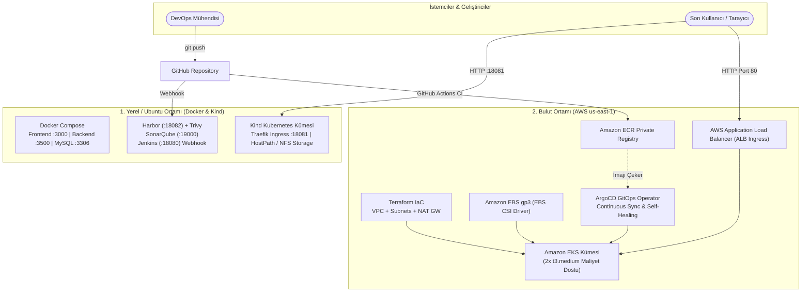

# Three-Tier DevOps Platform (React + Node.js + MySQL)

[](https://www.docker.com/)
[](https://kubernetes.io/)
[](https://www.terraform.io/)
[](https://aws.amazon.com/)
[](https://github.com/features/actions)
[](https://argoproj.github.io/cd/)

Bu proje; modern DevOps, Konteynerleştirme, Kubernetes Orkestrasyonu, DevSecOps ve Bulut Mimarisi (AWS) prensiplerini **3-katmanlı (3-Tier: Frontend + Backend + Database)** gerçek bir uygulama üzerinden adım adım uygulamak için tasarlanmış kurumsal bir eğitim ve pratik platformudur.

---

## 🏛️ Mimari Genel Bakış (Architecture Overview)



---

## 🧭 Adım Adım Laboratuvar Rehberi (14 Bağımsız Modül)

Tüm laboratuvarlar **birbirinden bağımsız** olarak çalıştırılabilir. İhtiyacınız olan modüle doğrudan geçiş yapabilirsiniz:

| Faz | Lab No | Başlık | Odak Noktaları | Kılavuz |
| :---: | :---: | :--- | :--- | :---: |
| **Faz 1** | **LAB-01** | Docker İmaj Optimizasyonu | Node 20 LTS, Nginx Multi-stage, 900MB -> 25MB (%97 tasarruf) | [İncele](labs/LAB-01-DOCKER-OPTIMIZATION/README.md) |
| **Faz 1** | **LAB-02** | Docker Compose 3-Tier | Bridge network izolasyonu, named volumes, `.env` değişkenleri | [İncele](labs/LAB-02-DOCKER-COMPOSE-3TIER/README.md) |
| **Faz 2** | **LAB-03** | Kubernetes Temelleri | Namespace, Pods, Deployments, ClusterIP Services, Health Probes | [İncele](labs/LAB-03-KIND-KUBERNETES-CORE/README.md) |
| **Faz 2** | **LAB-04** | ConfigMaps & Secrets | DB ve API parametrelerinin kod tabanından güvenli izolasyonu | [İncele](labs/LAB-04-KIND-CONFIGS-SECRETS/README.md) |
| **Faz 2** | **LAB-05** | Depolama ve Kalıcılık | HostPath PV/PVC ve Dinamik NFS StorageClass ile MySQL | [İncele](labs/LAB-05-KIND-STORAGE-PERSISTENCE/README.md) |
| **Faz 2** | **LAB-06** | Kind Traefik Ingress | Tek porttan (`18081`) Path Routing (`/` ve `/backend`) | [İncele](labs/LAB-06-KIND-TRAEFIK-INGRESS/README.md) |
| **Faz 3** | **LAB-07** | Harbor & Trivy Registry | Özel OCI registry, robot hesapları, CVE güvenlik taraması | [İncele](labs/LAB-07-HARBOR-PRIVATE-REGISTRY/README.md) |
| **Faz 3** | **LAB-08** | SonarQube SAST Analizi | Node.js ve React için statik kod kalitesi ve Quality Gates | [İncele](labs/LAB-08-SONARQUBE-CODE-QUALITY/README.md) |
| **Faz 3** | **LAB-09** | Jenkins Webhook CI/CD | GitHub Webhook -> Jenkins CI -> Harbor Push -> Kind Rollout | [İncele](labs/LAB-09-JENKINS-PIPELINE-WEBHOOK/README.md) |
| **Faz 4** | **LAB-10** | Terraform ile AWS EKS | AWS `us-east-1` VPC, 2x `t3.medium` standart node, Ubuntu Kubeconfig | [İncele](labs/LAB-10-TERRAFORM-AWS-EKS/README.md) |
| **Faz 4** | **LAB-11** | AWS EBS CSI Storage | Dinamik `gp3` StorageClass ile EKS üzerinde kalıcı MySQL | [İncele](labs/LAB-11-AWS-EBS-CSI-STORAGE/README.md) |
| **Faz 4** | **LAB-12** | AWS ALB Ingress | AWS Load Balancer Controller ile internete açık ALB | [İncele](labs/LAB-12-AWS-ALB-INGRESS/README.md) |
| **Faz 4** | **LAB-13** | GitHub Actions -> ECR | CI ile ECR'a imaj derleme & gönderme (EKS'e direkt deploy etmez) | [İncele](labs/LAB-13-GITHUB-ACTIONS-ECR/README.md) |
| **Faz 4** | **LAB-14** | ArgoCD ile GitOps | EKS üzerinde GitOps sürekli uzlaşma (Auto-sync) ve self-healing | [İncele](labs/LAB-14-ARGOCD-GITOPS-EKS/README.md) |

---

## ⚡ Hızlı Başlangıç (Docker Compose ile 1 Dakikada Çalıştırın)

```bash
# 1. Depoyu klonlayın
git clone https://github.com/hakanbayraktar/three-tier-devops-platform.git
cd three-tier-devops-platform

# 2. Ortam dosyasını hazırlayın
cp .env.example .env

# 3. 3-Katmanlı mimariyi başlatın
docker compose up -d --build

# 4. Tarayıcınızdan test edin
# Frontend: http://localhost:3000
# Backend API: http://localhost:3500/healthz
```
