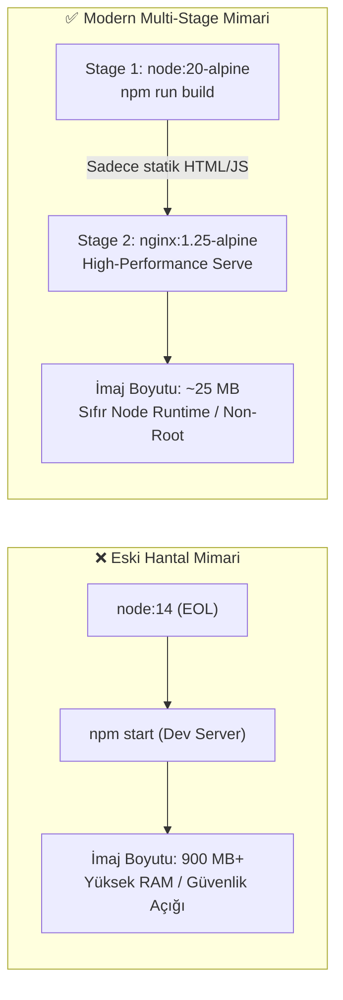

# LAB-01 — Dockerfile Modernizasyonu, Multi-Stage Build ve Güvenlik Sıkılaştırma

Bu laboratuvarda eski `node:14` tabanlı ve dev-server mantığıyla çalışan hantal konteyner yapılarını; modern **Node.js 20 LTS**, **Nginx Alpine Multi-Stage** mimarisine geçirerek imaj boyutunu **900 MB'tan ~25 MB'a (%97 tasarruf)** düşüreceğiz.

---

## 🛠️ Ön Koşullar ve Değişkenler

### Ortam Değişkenleri (Variables)
| Değişken | Açıklama | Varsayılan |
| :--- | :--- | :--- |
| `NODE_VERSION` | Kullanılan LTS Node sürümü | `20-alpine` |
| `REACT_APP_API_BASE_URL` | Frontend derlenirken gömülen API adresi | `http://localhost:3500/backend` |

### Ön Koşul Araçlar
* Docker Engine 24+ (`docker --version`)

---

## 1. Mimari Karşılaştırma



---

## 2. Adım Adım Uygulama

### Adım 1: Backend İmajını Derleyin ve Boyutunu İnceleyin
`backend/Dockerfile` dosyasında `node:20-alpine` ve non-root `node` kullanıcısı yapılandırılmıştır:

```bash
cd backend
docker build -t three-tier-backend:v1 .
```

İmaj boyutunu ve güvenlik kullanıcısını doğrulayın:
```bash
docker images three-tier-backend:v1
docker run --rm three-tier-backend:v1 id
# Beklenen Çıktı: uid=1000(node) gid=1000(node) (Rootless!)
```

### Adım 2: Frontend Multi-Stage İmajını Derleyin
`frontend/Dockerfile` dosyasında 1. aşamada React derlenir, 2. aşamada Nginx'e aktarılır:

```bash
cd ../frontend
docker build --build-arg REACT_APP_API_BASE_URL=http://localhost:3500/backend -t three-tier-frontend:v1 .
```

Boyut karşılaştırması yapın:
```bash
docker images three-tier-frontend:v1
# Beklenen Çıktı: ~25MB - 35MB arası
```

### Adım 3: Konteyneri Test Edin
```bash
docker run -d -p 3000:80 --name test-frontend three-tier-frontend:v1
curl -I http://localhost:3000/healthz
# Beklenen Çıktı: HTTP/1.1 200 OK
docker stop test-frontend && docker rm test-frontend
```
