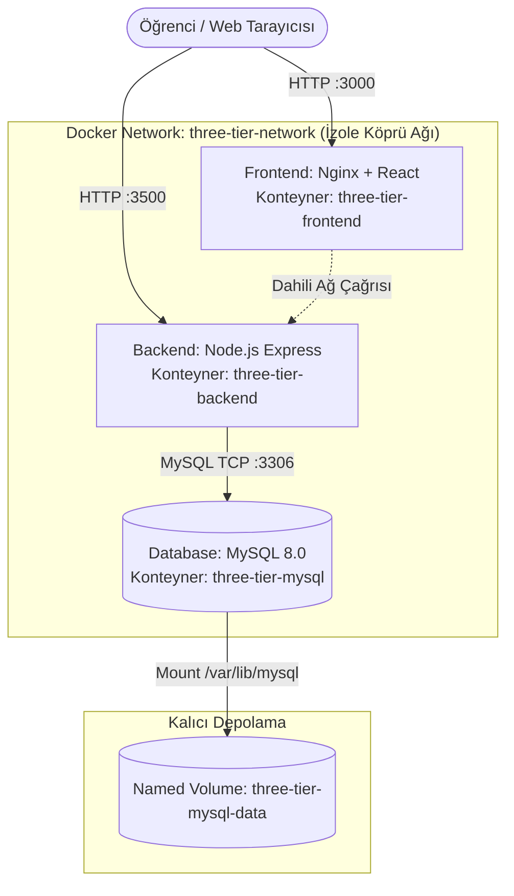

# LAB-02 — Docker Compose ile 3-Tier Uygulama Orkestrasyonu

Bu laboratuvarda Frontend (React/Nginx), Backend (Node.js API) ve Database (MySQL 8.0) katmanlarını izole bir Docker ağı (bridge network) ve kalıcı disk (volume) ile tek komutla ayağa kaldıracağız.

---

## 🛠️ Ön Koşullar ve Değişkenler

### Ortam Değişkenleri & Secret Matrisi
| Değişken / Secret | Tip | Değer | Açıklama |
| :--- | :---: | :--- | :--- |
| `MYSQL_ROOT_PASSWORD` | Secret | `SuperSecretPass123!` | MySQL root yönetici parolası |
| `MYSQL_DATABASE` | Variable | `school` | Otomatik oluşturulan veritabanı adı |
| `BACKEND_PORT` | Variable | `3500` | Node.js API host portu |
| `FRONTEND_PORT` | Variable | `3000` | React web arayüzü host portu |
| `REACT_APP_API_BASE_URL` | Variable | `http://localhost:3500/backend` | Ön yüzün tarayıcıdan bağlandığı API |

---

## 1. Mimari Şema



---

## 2. Adım Adım Uygulama

### Adım 1: `.env` Dosyasını Oluşturun
Proje kök dizininde `.env.example` dosyasını kopyalayın:
```bash
cp .env.example .env
```

### Adım 2: 3-Tier Yığını Başlatın
```bash
docker compose up -d --build
```

Servislerin sağlık (health) durumlarını kontrol edin:
```bash
docker compose ps
# Beklenen: three-tier-mysql (healthy), three-tier-backend (healthy), three-tier-frontend (running)
```

### Adım 3: Canlı Test ve Doğrulama
1. **Sağlık Kontrolü:**
   ```bash
   curl http://localhost:3500/healthz
   # Çıktı: {"status":"UP","service":"three-tier-backend"}
   ```
2. **Öğrenci Ekleme API Testi:**
   ```bash
   curl -X POST http://localhost:3500/backend/addstudent \
     -H "Content-Type: application/json" \
     -d '{"name": "Ahmet Yilmaz", "rollNo": 101, "class": "DevOps-101"}'
   ```
3. **Öğrenci Listeleme:**
   ```bash
   curl http://localhost:3500/backend/student
   ```
4. **Web Arayüzü:** Tarayıcınızdan `http://localhost:3000` adresini açarak öğrencinin tabloda göründüğünü doğrulayın.

### Adım 4: Veri Kalıcılığını (Persistence) Test Edin
```bash
# Konteynerleri durdurun ve silin
docker compose down

# Tekrar başlatın
docker compose up -d

# Veritabanındaki öğrencinin silinmediğini teyit edin
curl http://localhost:3500/backend/student
```
