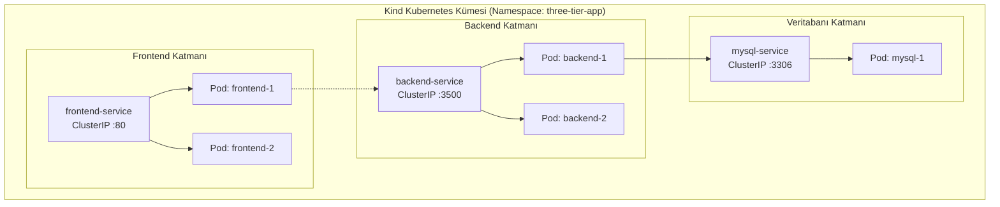

# LAB-03 — Kind Kubernetes Temelleri: Pods, Deployments ve ClusterIP Services

Bu laboratuvarda 3-katmanlı uygulamamızı Kind (Kubernetes-in-Docker) kümesi üzerine taşıyarak `three-tier-app` namespace'inde Deployment ve Service objeleriyle yöneteceğiz.

---

## 🛠️ Ön Koşullar ve Değişkenler

### Ortam Değişkenleri
| Değişken | Değer | Açıklama |
| :--- | :--- | :--- |
| `NAMESPACE` | `three-tier-app` | İzolasyon sağlayan K8s çalışma alanı |
| `BACKEND_PORT` | `3500` | Backend servis portu |
| `MYSQL_PORT` | `3306` | Veritabanı ClusterIP portu |

### Ön Koşul Araçlar
* Kind CLI (`kind --version`) ve `kubectl`

---

## 1. Kubernetes Küme Mimarisi



---

## 2. Adım Adım Uygulama

### Adım 1: Namespace ve Temel İmajları Yükleyin
Kind kümesi Docker içinde çalıştığı için yerel imajları kümeye yükleyin:
```bash
kind load docker-image three-tier-backend:v1 --name kind
kind load docker-image three-tier-frontend:v1 --name kind
```

Namespace'i oluşturun:
```bash
kubectl apply -f k8s/base/00-namespace.yaml
```

### Adım 2: MySQL, Backend ve Frontend Katmanlarını Dağıtın
```bash
kubectl apply -f k8s/base/01-mysql-secrets.yaml
kubectl apply -f k8s/base/02-mysql-storage-hostpath.yaml
kubectl apply -f k8s/base/03-mysql-deployment.yaml
kubectl apply -f k8s/base/04-backend.yaml
kubectl apply -f k8s/base/05-frontend.yaml
```

### Adım 3: Pod ve Servis Durumlarını Kontrol Edin
```bash
kubectl get pods -n three-tier-app -o wide
# Beklenen: Tüm podlar 'Running' ve 1/1 veya 2/2 durumunda olmalıdır.

kubectl get svc -n three-tier-app
```

### Adım 4: Port-Forward ile Yerel Doğrulama
```bash
# Arka planda frontend portunu iletin
kubectl port-forward svc/frontend-service 8080:80 -n three-tier-app &

# Tarayıcıdan veya curl ile test edin
curl -I http://localhost:8080/healthz
# HTTP/1.1 200 OK
```
