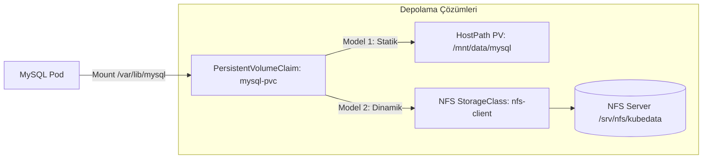

# LAB-05 — Kubernetes Kalıcı Depolama: HostPath PV/PVC ve Dinamik NFS StorageClass

Bu laboratuvarda veritabanı podu silinse veya yeniden başlasa bile verilerin kaybolmaması için **PersistentVolume (PV)**, **PersistentVolumeClaim (PVC)** ve Ubuntu üzerinde **Dinamik NFS StorageClass** mimarisini uygulayacağız.

---

## 1. Depolama Mimarisi



---

## 2. Model 1: HostPath ile Yerel Kalıcılık Testi

MySQL podunu silip verilerin korunduğunu test edin:
```bash
# 1. Pod adını bulun ve silin (Deployment otomatik yenisini başlatır)
MYSQL_POD=$(kubectl get pod -n three-tier-app -l app=mysql -o jsonpath="{.items[0].metadata.name}")
kubectl delete pod $MYSQL_POD -n three-tier-app

# 2. Yeni podun başladığını izleyin
kubectl get pods -n three-tier-app -w

# 3. Verilerin yerinde durduğunu API üzerinden teyit edin
kubectl port-forward svc/backend-service 3500:3500 -n three-tier-app &
curl http://localhost:3500/backend/student
```

---

## 3. Model 2: Ubuntu Üzerinde Dinamik NFS StorageClass (Opsiyonel / İleri Seviye)

Ubuntu sunucusunda NFS sunucusu kurup Kind'a dinamik disk bağlamak için:
```bash
# 1. NFS Kernel Server Kurulumu
sudo apt update && sudo apt install -y nfs-kernel-server
sudo mkdir -p /srv/nfs/k8s-data
sudo chown -R nobody:nogroup /srv/nfs/k8s-data
sudo chmod 777 /srv/nfs/k8s-data

echo "/srv/nfs/k8s-data *(rw,sync,no_subtree_check,no_root_squash)" | sudo tee -a /etc/exports
sudo exportfs -a
sudo systemctl restart nfs-kernel-server

# 2. Helm ile NFS Subdir External Provisioner Kurulumu
helm repo add nfs-subdir-external-provisioner https://kubernetes-sigs.github.io/nfs-subdir-external-provisioner/
helm install nfs-client nfs-subdir-external-provisioner/nfs-subdir-external-provisioner \
    --set nfs.server=172.17.0.1 \
    --set nfs.path=/srv/nfs/k8s-data \
    --set storageClass.name=nfs-client
```
