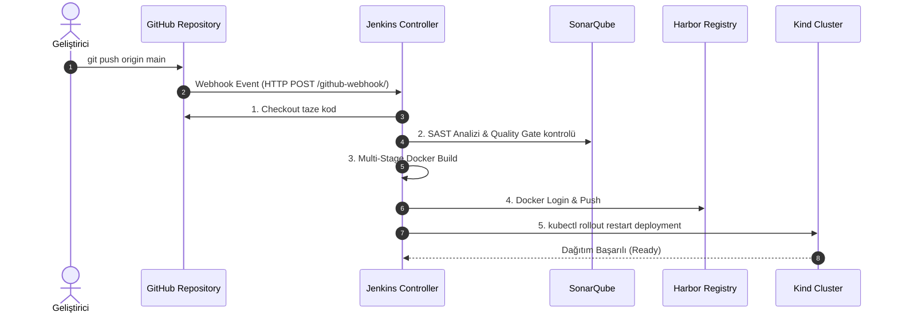

# LAB-09 — Jenkins Declarative Pipeline ve GitHub Webhook Otomasyonu

Bu laboratuvarda geliştirici GitHub reposuna kod pushladığında **GitHub Webhook** aracılığıyla Jenkins'in anında tetiklenmesini, testlerin koşmasını, imajların Harbor'a atılmasını ve Kind kümesinde uygulamanın sıfır kesintiyle güncellenmesini (Rollout) otomatikleştireceğiz.

---

## 1. Uçtan Uca Boru Hattı Mimarisi



---

## 2. Uygulama Adımları

### Adım 1: GitHub Webhook Tanımlama
1. GitHub reponuza gidin -> **Settings** -> **Webhooks** -> **Add webhook**.
2. **Payload URL:** `http://<UBUNTU_IP>:18080/github-webhook/`
3. **Content type:** `application/json`
4. **Events:** "Just the push event" seçin ve kaydedin.

### Adım 2: Jenkins Pipeline Job'ını Oluşturun
1. Jenkins arayüzüne gidin (`http://<UBUNTU_IP>:18080`).
2. **New Item** -> `three-tier-pipeline` -> **Pipeline** seçin.
3. **Build Triggers:** "GitHub hook trigger for GITScm polling" kutusunu işaretleyin.
4. **Pipeline Definition:** "Pipeline script from SCM" seçin, Git URL'inizi girin ve Script Path olarak `jenkins/Jenkinsfile` belirtin.

### Adım 3: Test Push Yapın ve Boru Hattını İzleyin
```bash
git commit --allow-empty -m "trigger: test jenkins webhook rollout"
git push origin main
```
Jenkins arayüzünde yeni bir derlemenin (Build) otomatik başladığını ve Kind kümesindeki podların yenilendiğini izleyin:
```bash
kubectl rollout status deployment/backend -n three-tier-app
```
