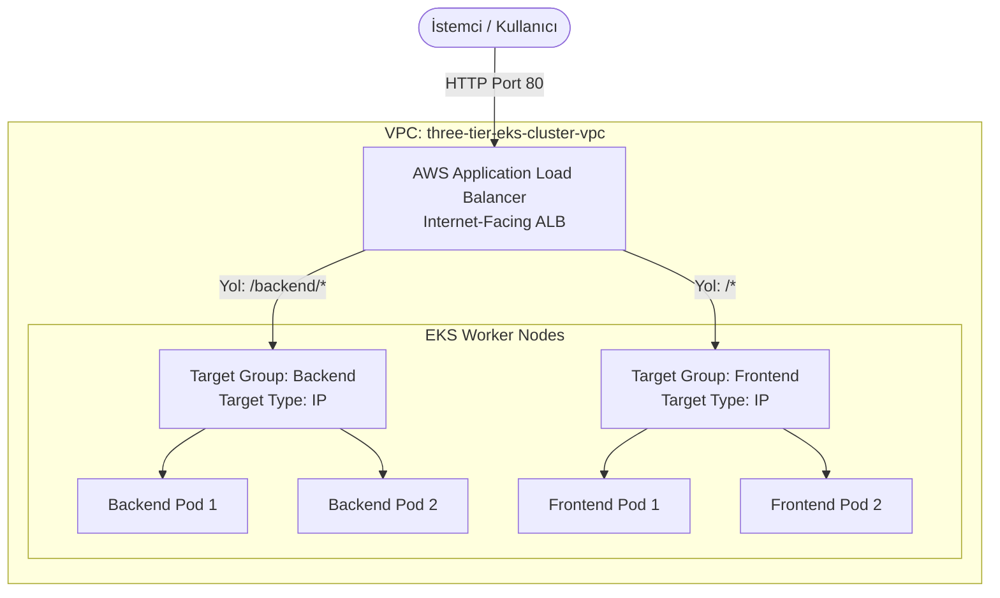

# LAB-12 — AWS Load Balancer Controller ve Application Load Balancer (ALB) Ingress

Bu laboratuvarda AWS EKS üzerinde **AWS Load Balancer Controller** kullanarak, Kubernetes `Ingress` objesi oluşturulduğunda AWS'de otomatik olarak bir **Application Load Balancer (ALB)** ayağa kaldıracak ve trafiği `us-east-1` üzerinden dağıtacağız.

---

## 1. AWS ALB Ağ ve Yönlendirme Mimarisi



---

## 2. Adım Adım Uygulama

### Adım 1: AWS Load Balancer Controller Helm ile Kurulumu
```bash
# Helm reposunu ekleyin
helm repo add eks https://aws.github.io/eks-charts
helm repo update

# Controller kurulumu
helm install aws-load-balancer-controller eks/aws-load-balancer-controller \
  -n kube-system \
  --set clusterName=three-tier-eks-cluster \
  --set serviceAccount.create=true
```

### Adım 2: ALB Ingress Manifestini Uygulayın
```bash
kubectl apply -f k8s/base/04-backend.yaml
kubectl apply -f k8s/base/05-frontend.yaml
kubectl apply -f k8s/eks/03-ingress-alb.yaml
```

### Adım 3: ALB DNS Adresini Alın ve Canlı Test Edin
```bash
kubectl get ingress -n three-tier-app
# ADDRESS sütununda: k8s-threetie-threetie-xxxxxxxx.us-east-1.elb.amazonaws.com görünür.
```

Tarayıcınızdan veya curl ile ALB adresini test edin:
```bash
ALB_URL=$(kubectl get ingress three-tier-alb-ingress -n three-tier-app -o jsonpath="{.status.loadBalancer.ingress[0].hostname}")
curl -I http://$ALB_URL/healthz
# HTTP/1.1 200 OK
```
